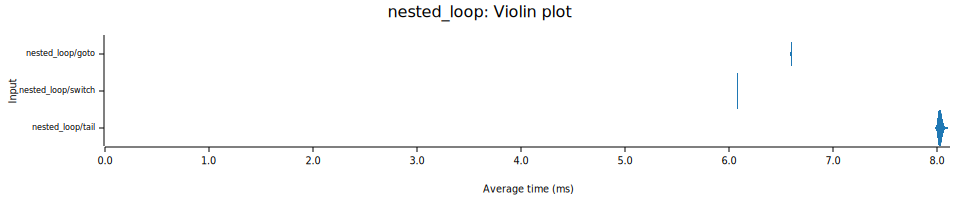
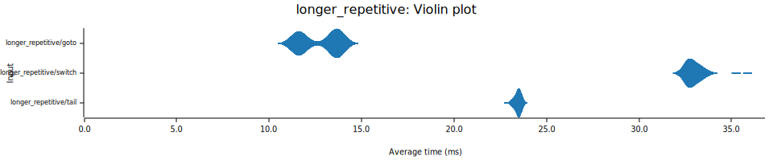
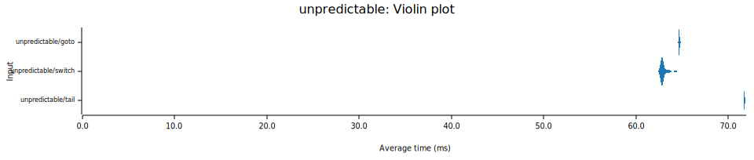
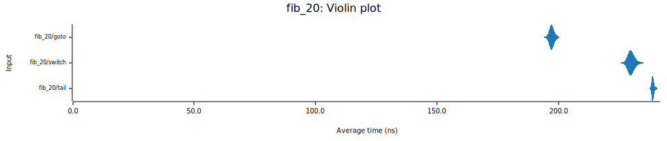
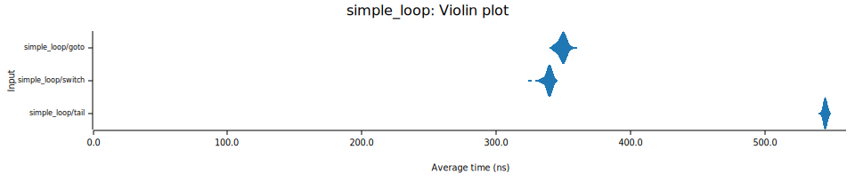
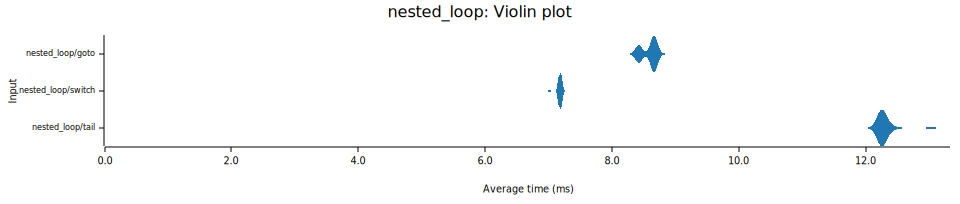
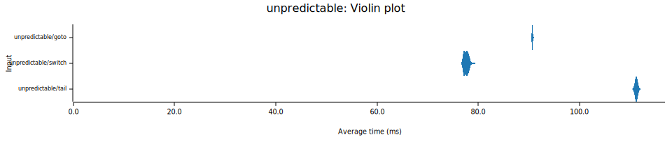

# vm-perf

This is an attempt to compare various dispatch techniques and VM architectures.

It is a follow-up to the great work done in [pliniker/dispatches](https://github.com/pliniker/dispatchers).
There are a few differences, including (but not limited to):
- Computed goto implementation uses the now-stable Rust inline assembly, and is implemented only for `x86_64` and `aarch64` (mach-o only, elf doesn't work).
- The bytecode used in benchmarks is much closer to what an actual bytecode compiler would generate [^1]
- Added an extra benchmark: `fib_20`, which calculates the 20th fibonacci number using an iterative algorithm.
- This experiment also attempts to compare different VM architectures instead of only comparing dispatch techniques for the same register-based VM.

The VM architectures implemented are:
- Register-based
- 🚧 Stack-based
- 🚧 Register-based with accumulator (similar to V8)

The dispatch techniques implemented are:
- `switch`: basic `loop` + `match`
- `goto`: indirect threading using computed goto implemented via inline assembly
- `tail`: tail-call dispatch

## Running the benchmarks

```
$ cargo bench
$ ./report.py
```

Results will be generated into the [`report`](./report) directory.

## Disassembly

You can find the assembly generated by my configuration (`x86_64`, `Ubuntu 22.04`, `rustc 1.72.0-nightly (101fa903b 2023-06-04)`) under [`results/x86_64`](./results/x86_64):
- [switch](./results/x86_64/switch.S)
- [goto](./results/x86_64/goto.S)
- [tail](./results/x86_64/tail.S)

To disassemble the VM yourself:

- First, compile the benchmark binary with `--message-format=json`:
  ```
  $ cargo build --bench fixtures --release --message-format=json
  ```

- The last few lines of spam will contain something like:
  ```
  {
    ... a lot of JSON
  "filenames":[".../vm-perf/target/release/deps/fixtures-5c724c19614ffd64"],
  "executable":".../vm-perf/target/release/deps/fixtures-5c724c19614ffd64",
  "fresh":true
  }
  {"reason":"build-finished","success":true}
  ```
  The benchmark binary is specified as `executable`.

- Disassemble the benchmark binary using `objdump`:
  ```
  $ objdump \
    --disassembler-options=intel \
    --demangle=rust \
    --disassemble \
    target/release/deps/fixtures-5c724c19614ffd64 > dis.S
  ```

The various dispatch methods are marked with `#[no_mangle]`:
- `switch` can be found at the label `<switch>`
- `goto` can be found at the label `<goto_inner>`
- `tail` can be found at the label `<tail>`
  - For `tail`, every instruction is also a separate function: `op_nop`, `op_ldi`, `op_ret`, etc.

## Benchmarks

### Simple loop

A basic loop. The body of the loop does no work other than decrement the counter from `42` to `0`.

### Nested loop

The same as [simple loop](#simple-loop), but nested where `i` starts at `10000` and `j` starts at `100`.

### Longer repetitive

The same as [nested loop](#nested-loop), but each instruction is followed by 3 `add` instructions which all add zero to a variable.

### Unpredictable

Similar to [nested loop](#nested-loop), but randomly repeats iterations of both the inner and outer loop. The idea is to make the loop more unpredictable. The rng uses the same seed for all dispatch methods, so they all do the same number of iterations.

### 20th fibonacci number

Uses an iterative algorithm to calculate the 20th fibonacci number.

## Results (x86_64, Linux, AMD Ryzen 9 7950X)







## Results (aarch64, MacOS, Macbook Air M2)







[^1]: For example, each loop is prefixed by a proper loop header which checks the condition first and only then enters the loop, as opposed to assuming that the first iteration of the loop should always run. This required making some changes to the instruction set, such as using `jump if false` (`jif`) instead of `jump if true` (`jit`).
