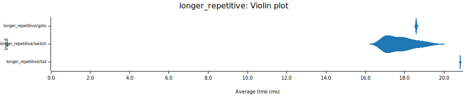

# vm-perf

## Running the benchmarks

```
$ cargo bench
$ ./report.py
```

Results will be generated into the [`report`](./report) directory.

## Benchmarks

### Simple loop

A basic loop. The body of the loop does no work other than decrement the counter from `42` to `0`.

### Nested loop

The same as [simple loop](#simple-loop), but nested where `i` starts at `10000` and `j` starts at `100`.

### Longer repetitive

The same as [nested loop](#nested-loop), but each instruction is followed by 3 `add` instructions which all add zero to a variable.

### Unpredictable

Similar to [nested loop](#nested-loop), but randomly repeats iterations of both the inner and outer loop. The idea is to make the loop more unpredictable. The rng uses the same seed for all dispatch methods, so they all do the same number of iterations.

### 20th fibonacci number

Uses an iterative algorithm to calculate the 20th fibonacci number.

## Results (x86_64, Linux, AMD Ryzen 9 7950X)


## Results (aarch64, MacOS, Macbook Air M2)





