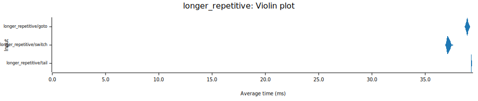
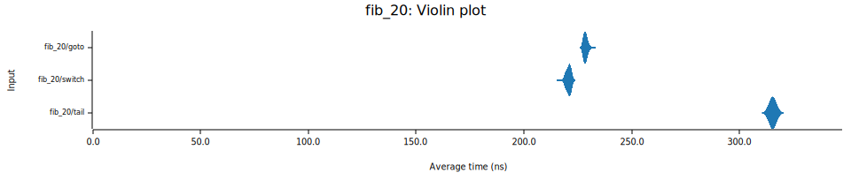

# vm-perf

This is an attempt to compare various dispatch techniques and VM architectures.

The VM architectures implemented are:
- Register-based
- 🚧 Stack-based
- 🚧 Register-based with accumulator (similar to V8)

The dispatch techniques implemented are:
- `switch`: basic `loop` + `match`
- `goto`: indirect threading using computed goto implemented via inline assembly
- `tail`: tail-call dispatch

## Running the benchmarks

```
$ cargo bench
$ ./report.py
```

Results will be generated into the [`report`](./report) directory.

## Disassembly

It's useful to look at the assembly generated by the compiler.

First, compile the benchmark binary with `--message-format=json`:
```
$ cargo build --bench fixtures --release --message-format=json
```

The last few lines of spam will contain something like:
```
{
  ... a lot of JSON
"filenames":[".../vm-perf/target/release/deps/fixtures-5c724c19614ffd64"],
"executable":".../vm-perf/target/release/deps/fixtures-5c724c19614ffd64",
"fresh":true
}
{"reason":"build-finished","success":true}
```
The benchmark binary is specified as `executable`.

You can disassemble the benchmark binary using `objdump`:

```
$ objdump \
  --disassembler-options=intel \
  --demangle=rust \
  --disassemble \
  PATH_TO_THE_BINARY > dis.S
```

The various dispatch methods are marked with `#[no_mangle]` for easier discovery.
- `switch` can be found at the label `<switch>`
- `goto` can be found at the label `<goto_inner>`
- `tail` can be found at the label `<tail>`
  - For `tail`, every instruction is also a separate function: `op_nop`, `op_ldi`, `op_ret`, etc.

## Benchmarks

### Simple loop

A basic loop. The body of the loop does no work other than decrement the counter from `42` to `0`.

### Nested loop

The same as [simple loop](#simple-loop), but nested where `i` starts at `10000` and `j` starts at `100`.

### Longer repetitive

The same as [nested loop](#nested-loop), but each instruction is followed by 3 `add` instructions which all add zero to a variable.

### Unpredictable

Similar to [nested loop](#nested-loop), but randomly repeats iterations of both the inner and outer loop. The idea is to make the loop more unpredictable. The rng uses the same seed for all dispatch methods, so they all do the same number of iterations.

### 20th fibonacci number

Uses an iterative algorithm to calculate the 20th fibonacci number.

## Results (x86_64, Linux, AMD Ryzen 9 7950X)





## Results (aarch64, MacOS, Macbook Air M2)




